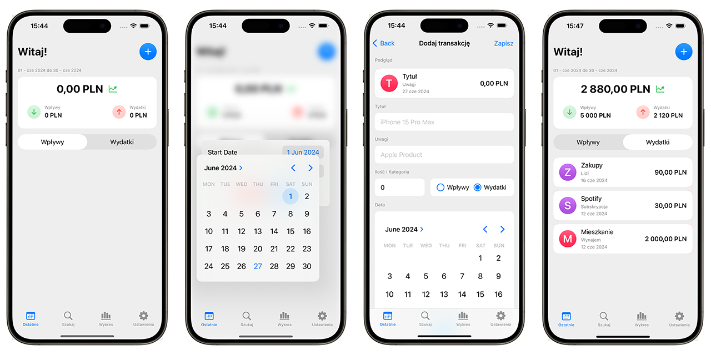
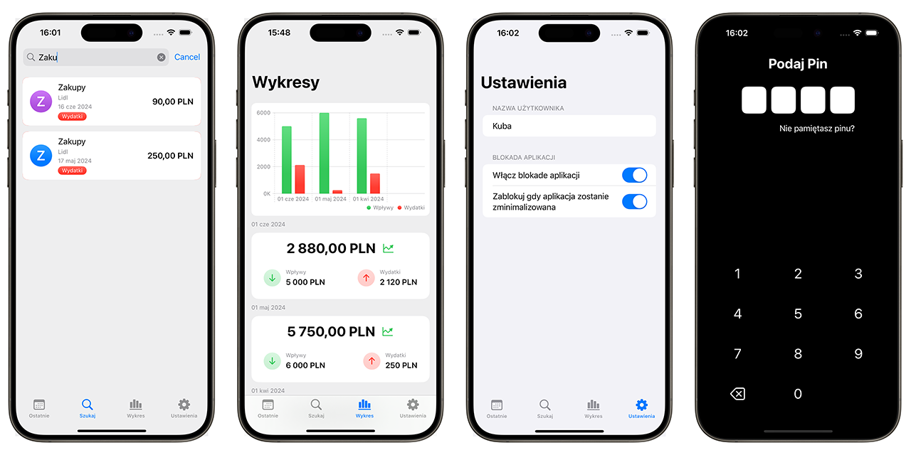

# Spend Sense

Welcome to Spend Sense! This iOS application is designed to provide a convenient and transparent way to monitor your expenses and income. With Spend Sense, you can easily add, edit, search, and visualize your financial transactions, helping you stay on top of your finances.

## Features

- **Add Transactions**: Users can add both income and expense transactions.
- **Edit Transactions**: Users can edit existing transactions to update details as needed.
- **Search Functionality**: Users can search for transactions by name or notes, making it easy to find specific entries.
- **Data Visualization**: Display your financial data on a chart to get a clear overview of your spending and income patterns.
- **Monthly Summary Widget**: A widget that shows the total expenses and income for the current month at a glance.
- **Security**: Option to lock the app with a PIN and Face ID for enhanced security.

## Technologies Used

- **Swift**: The primary programming language for iOS development.
- **SwiftUI**: A framework for building user interfaces.
- **CoreData**: Used for local data storage and management.
- **Charts**: External library for creating beautiful and informative charts.
- **LocalAuthentication**: Framework used for Face ID and PIN security features.

## Getting Started

1. Clone the repository to your local machine.
2. Open the project in Xcode.
3. Build and run the application on your iOS simulator or device.

## Screenshots

*Screenshot: Main screen, Date selection menu, Add transaction screen, List of added expenses and income.*

*Screenshot: Search transactions screen, Chart screen, Application settings, Lock screen.*

## How to Use

1. **Adding Transactions**: Navigate to the 'Recents' screen, click plus button and enter the details of the transaction, and save.
2. **Editing Transactions**: Select a transaction from the list, make necessary changes, and save.
3. **Searching Transactions**: Use the search bar at the top of the 'Find' screen to find specific entries by name or notes.
4. **Viewing Data on Chart**: Access the 'Chart' section to see a visual representation of your income and expenses over time.
5. **Monthly Summary Widget**: Add the Spend Sense widget to your home screen for quick access to monthly totals.
6. **Security Settings**: Set up a PIN and enable Face ID in the settings to secure your app.

## Security

Spend Sense ensures the security of your financial data by providing options to lock the app with a PIN and Face ID. These features help prevent unauthorized access and keep your information safe.
